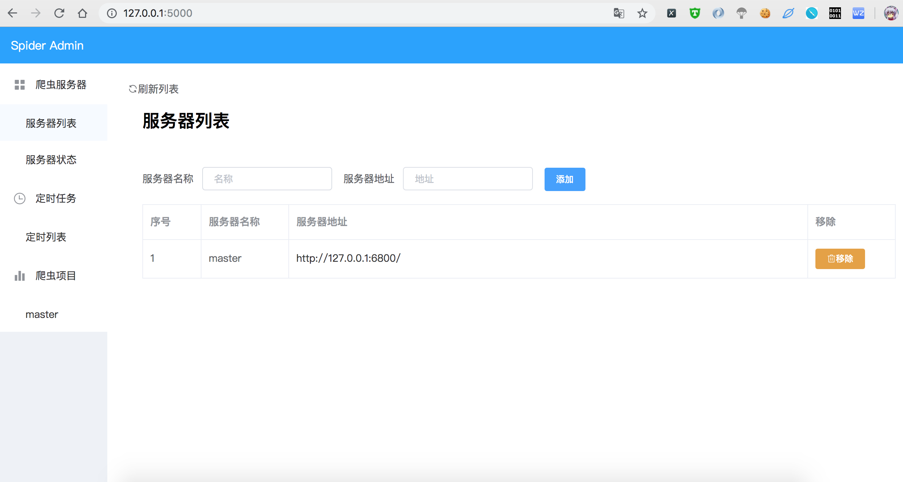
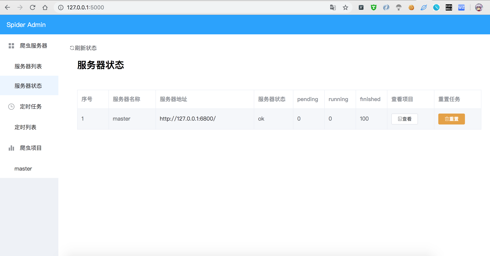
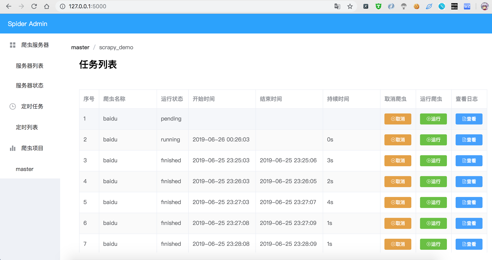
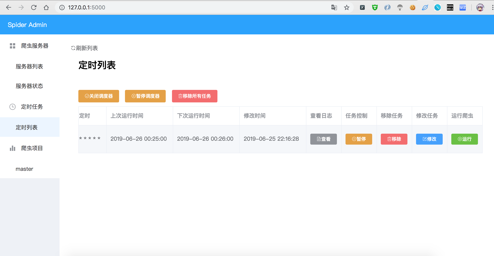

SpiderAdmin
===========

.. figure:: https://img.shields.io/pypi/v/spideradmin.svg
   :alt: PyPI

   PyPI

-  github: https://github.com/mouday/SpiderAdmin
-  pypi: https://pypi.org/project/spideradmin/

功能介绍
--------

1. 对Scrapyd 接口进行可视化封装，对Scrapy爬虫项目进行删除 和 查看

2. 并没有实现修改，添加功能, 部署推荐使用

   .. code:: bash

       $ scrapyd-deploy -a

3. 对爬虫设置定时任务，支持apscheduler 的3中方式和随机延时，共计4中方式

-  单次运行 date
-  周期运行 corn
-  间隔运行 interval
-  随机运行 random

4. 基于Flask-BasicAuth 做了简单的权限校验

启动运行
--------

::

    $ pip3 install spideradmin

    $ spideradmin init  # 初始化，可选配置，也可以使用默认配置

    $ spideradmin       # 启动服务

访问： http://127.0.0.1:5000/

页面截图
--------

TODO
----

1. [STRIKEOUT:增加登录页面做权限校验]
2. [STRIKEOUT:增加定时设置的多样性]
3. [STRIKEOUT:增加定时随机运行]
