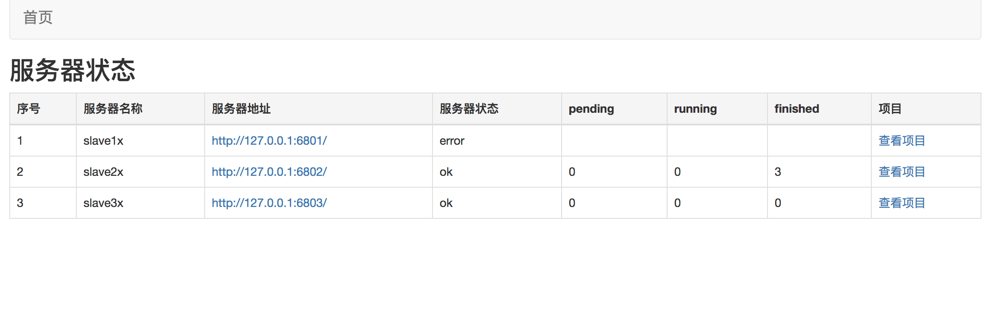
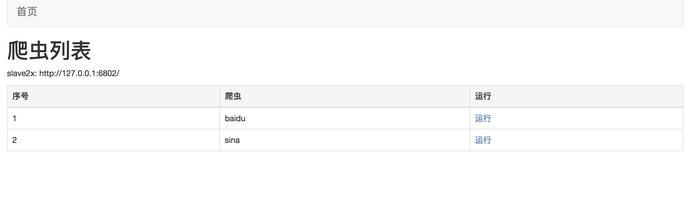
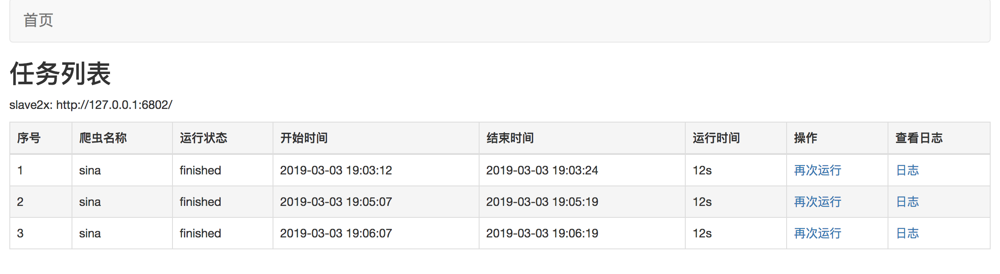

# SpiderAdmin
通过调用Scrapyd API 对多个爬虫服务器进行监控，数据显示
多个Scrapyd的状态监控 可视化客户端

Scrapyd version=1.2.0

# 运行

```
pip install -r requirements.txt
python3 main.py
```

访问：http://127.0.0.1:5000

# 项目截图
1、主页



2、项目页


3、爬虫页



4、任务页



# 服务关系
```
SpiderAdmin
    |--Scrapyd Server1
        |--Project1
            |--Version1
                |--Spider1
                |--Spider2
                |--Spider3
                |--...
            |--Version2
            |--Version3
            |--...
        |--Project2
        |--Project3
        |--...
    |--Scrapyd Server2
    |--Scrapyd Server3
    |--...
```
只要知道Scrapyd server服务器的地址，就可以查询project项目，进而查询version, 然后查询spider

# Scrapyd接口
```
# 服务器查询
    服务器状态
# 项目操作
    添加项目版本（一个项目下可以有多个版本）
    项目列表
    项目版本列表
    删除项目
    删除项目版本
# 爬虫操作
    项目中爬虫列表
    调度运行爬虫
    任务列表
    取消爬虫
```

# 项目参考：

1. scrapyd-api: https://github.com/djm/python-scrapyd-api

2. scrapyd: https://scrapyd.readthedocs.io/en/stable/api.html

3. scrapyd-client: https://github.com/scrapy/scrapyd-client

4. peewee: http://docs.peewee-orm.com/en/latest/peewee/querying.html#bulk-inserts
